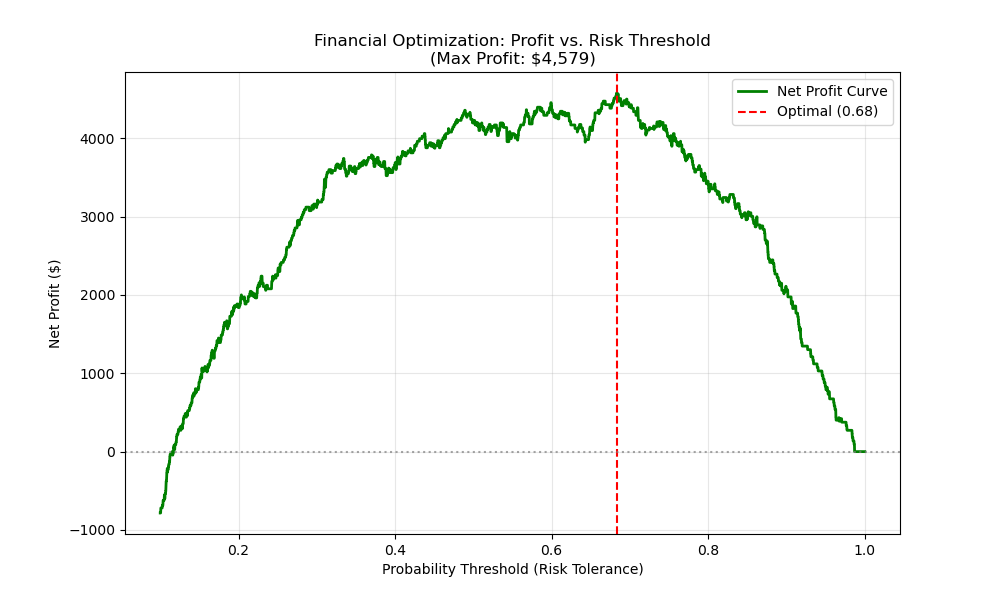
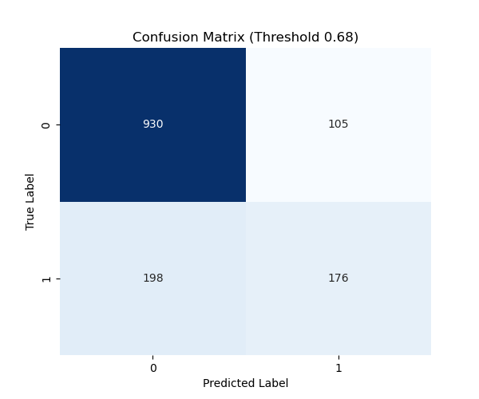
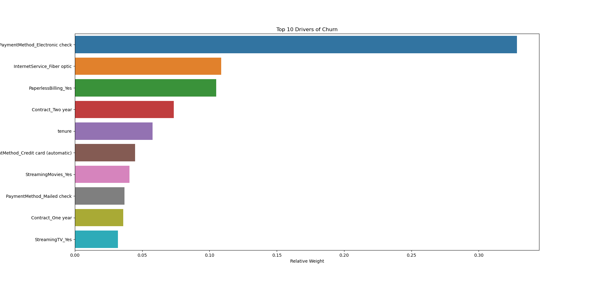

# 📡 Smart Retention System: An Approach to Churn Prediction


> **Business Impact:** Maximizes Net Profit by optimizing intervention thresholds, rather than just raw model accuracy.

---

## 📖 Executive Summary

This project implements an **End-to-End Churn Prediction System** that applies **physical optimization principles** to business strategy. Instead of using the default classification threshold ($P > 0.5$), I derived a **financially optimal threshold ($P > 0.68$)** based on the system's "Hamiltonian" (Revenue vs. Retention Cost).

**Key Outcome:**
* **Optimization:** Shifted the operating threshold from 0.50 to **0.68** to minimize financial waste.
* **Impact:** Identified **338 high-risk customers** (Top 6.5% of active base) requiring immediate intervention.
* **Projected Value:** Estimated **$4,578.65 Net Profit** on the Test Set by intervening only when mathematically justified.

---

## ⚛️ The Physicist's Edge: From Theory to Industry

As a Physics graduate, I approached this data science problem as a complex system optimization task. Here is how my background influenced the architecture:

1.  **Signal-to-Noise Optimization:** Handling class imbalance (Churners are rare) is analogous to detecting a weak signal in background noise (or an unstable nucleus). I utilized **SMOTE** (Synthetic Minority Over-sampling Technique) to ``amplify the signal'' during training without introducing bias.
2.  **Vector Space Mapping:** Customer attributes were projected into a high-dimensional vector space using **One-Hot Encoding**, ensuring mathematical orthogonality between categorical variables to avoid multicollinearity.
3.  **Cost Function Engineering:** In physics, systems evolve to minimize energy. In this business context, I engineered the model to **maximize the Profit Function**:
    $$Profit = (N_{TP} \times LTV_{Saved}) - (N_{Contacted} \times Cost_{Intervention})$$
    This derived a precise operating point, making the model "surgical" rather than "paranoid."

---

## 📊 Performance & Insights

### 1. The Financial Optimization Curve
Unlike standard models that blindly predict, this system scans through probability thresholds to find the resonance point where profit is maximized.



### 2. Confusion Matrix (Calibrated)
By applying the calculated threshold (0.68), we accept lower Recall in exchange for much higher Precision. We stop wasting money on customers who are likely to stay (False Positives).



### 3. Key Drivers of Churn
Using XGBoost's feature importance, we diagnosed the root causes of the system instability (Churn).


*Figure 3: Top Drivers. 'Fiber Optic' service and 'Electronic Check' payments are the highest friction points causing customer exit.*

**Business Insight:** The "Electronic Check" payment method is the #1 silent killer. A simple campaign incentivizing "Automatic Payments" could significantly reduce churn.

---

## 🛠️ Technical Architecture

The project is structured as a modular pipeline, simulating a production environment:

* **🗄️ ETL Layer (`setup_database.py`):** Ingests raw CSV data, cleans it, and structures it into a relational **SQLite** database (`telecom_churn.db`).
* **📈 Analysis Layer (`sql_analysis.py`):** SQL queries to extract initial business insights (ARPU analysis, Churn Rate by segment).
* **🧠 Modeling Layer (`train_model.py`):**
    * Algorithm: **XGBoost Classifier**.
    * Technique: SMOTE for imbalance.
    * **Innovation:** Includes a financial feedback loop to save the model *and* the optimal threshold (`churn_system.pkl`).
* **🚀 Production Layer (`generate_leads.py`):** Loads the saved system, connects to the live database, and generates a CSV `ACTION_PLAN` for sales agents.
* **💻 Deployment Layer (`dashboard.py`):** An interactive **Streamlit** command center for stakeholders to monitor risk in real-time.

---

## 💻 How to Run Locally

1.  **Clone the repository:**
    ```bash
    git clone [https://github.com/diegofranco2410/churn_prediction.git](https://github.com/diegofranco2110/churn_prediction.git)
    cd churn_prediction
    ```

2.  **Install dependencies:**
    ```bash
    pip install -r requirements.txt
    ```

3.  **Run the Streamlit App:**
    ```bash
    streamlit run dashboard.py
    ```

---

## 📜 License
This project is open-source under the MIT License.

## 📬 Contact
Created by **Diego Franco** - B.Sc. Physicist & Data Science Practitioner.
[LinkedIn](https://www.linkedin.com/in/diegofranco2410/) | [Email](mailto:diegofranco2410@gmail.com)

